<div align="center">

# DevNotes

**A developer knowledge cockpit — capture fast, reuse smarter, publish beautifully.**

Save the commands, configs, fixes and guides you'd otherwise lose to scratch files, find them again in milliseconds, and publish the good ones as pages worth sharing.

[](https://github.com/rahuldr07/DevNotes/actions/workflows/ci.yml)


[**Live app**](https://dev-notes-gilt.vercel.app) · [**Launch video**](docs/media/devnotes-launch.mp4) · [Screenshots](#screenshots) · [Quick start](#quick-start) · [Architecture](#architecture)

<a href="docs/media/devnotes-launch.mp4">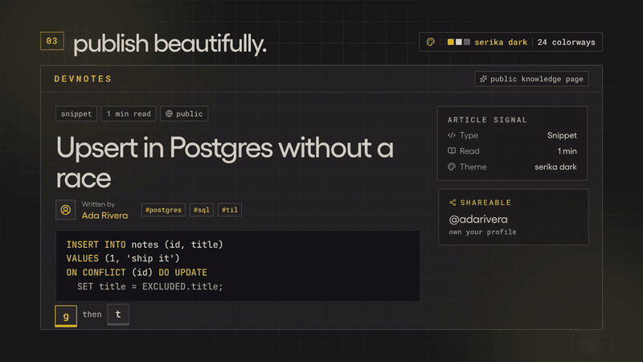</a>

</div>

---

## Table of contents

- [Why DevNotes](#why-devnotes)
- [Features](#features)
- [Screenshots](#screenshots)
- [Keyboard shortcuts](#keyboard-shortcuts)
- [Tech stack](#tech-stack)
- [Architecture](#architecture)
- [Quick start](#quick-start)
- [Configuration](#configuration)
- [Scripts](#scripts)
- [Testing and CI](#testing-and-ci)
- [API overview](#api-overview)
- [Project structure](#project-structure)
- [Design decisions](#design-decisions)
- [Deployment](#deployment)
- [Known limitations](#known-limitations)
- [Roadmap](#roadmap)
- [Contributing](#contributing)
- [License](#license)

## Why DevNotes

Every developer has fixed the same bug twice because the first fix was sitting in a scratch file, a closed terminal, or a tab that's long gone. DevNotes is built around one loop:

```text
capture → organize → retrieve → reuse → publish → grow
```

Capture is one submit, retrieval is a ranked full-text search behind `Ctrl+K`, and anything worth sharing becomes a clean public page in one click.

## Features

**Capture**
- **Quick capture** — save a note, snippet, link, or task from the dashboard in one submit, with starter templates (`til`, `bug fix`, `command`, `checklist`).
- **Editor** — notes open in a reading view; press `e` to edit. Markdown shortcuts, a block insert menu, code blocks with language and copy headers.
- **Version history** — every edit snapshots the previous version (the latest 20 per note are kept) and can be previewed or restored.

**Retrieve and reuse**
- **Ranked search** — PostgreSQL full-text search (`websearch_to_tsquery` + `ts_rank` over a generated `tsvector` column) behind a keyboard-first command palette, with inline filters like `tag:react type:snippet lang:sql`.
- **Snippet vault** — code-first notes grouped into language lanes with copy-ready blocks (`/dashboard/snippets`).
- **Ask Workspace** — retrieval-first Q&A over your own notes: ask a question, get ranked source cards with highlighted excerpts (`/dashboard/ask`). Built so LLM answer synthesis can sit on top and cite these exact sources.
- **Knowledge pulse** — a 26-week activity heatmap with streaks, plus pinned notes and a publish queue on the dashboard.

**Publish**
- **Public pages** — one click turns a private note into a public page with an author card, reading time, related notes and Open Graph metadata (`/s/<share_uuid>`).
- **Developer profiles** — public profiles at `/u/<username>` listing a user's published notes.
- **Explore** — a community feed of published notes with trending/recent sorting, topics, likes and view counts.

**Make it yours**
- **Theme Studio** — 24 colorways (Serika Dark, Catppuccin Mocha, Paper CLI, Tokyo Night, Rosé Pine, Nord, Matrix, Synthwave '84, Sakura and more) with independent typeface and corner dials. Open it with `g` then `t`; everything previews inside the studio and the app only changes when you apply.

**Security**
- HttpOnly cookie auth behind a same-origin proxy, rotating refresh tokens with reuse detection, per-device sessions, and per-route rate limits. See [Design decisions](#design-decisions).

## Screenshots

Each screenshot is taken in a different colorway; captions name the one shown.

### Dashboard

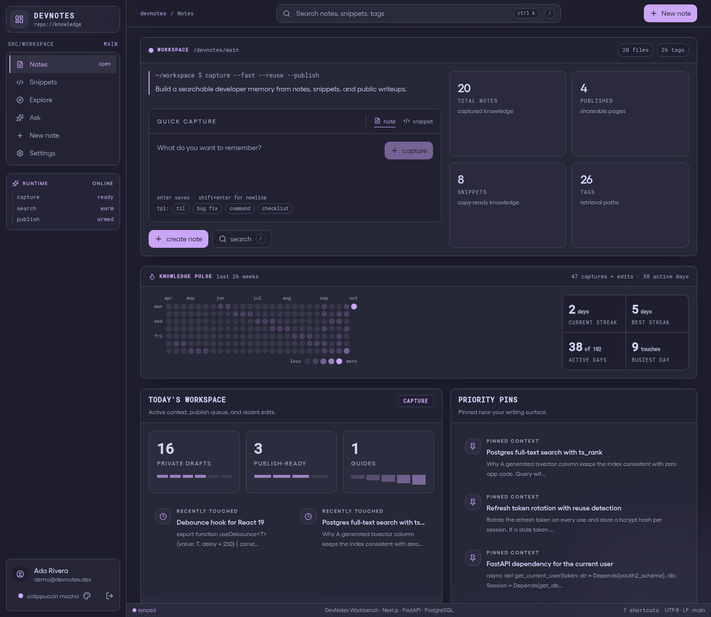

<sub>Dashboard — Catppuccin Mocha</sub>

### Themes

Typeface and corners are separate dials. Each colorway ships with its own pairing — Paper CLI uses Lora, Matrix uses JetBrains Mono with square corners, Sakura rounds to 14px — and either dial can be overridden.

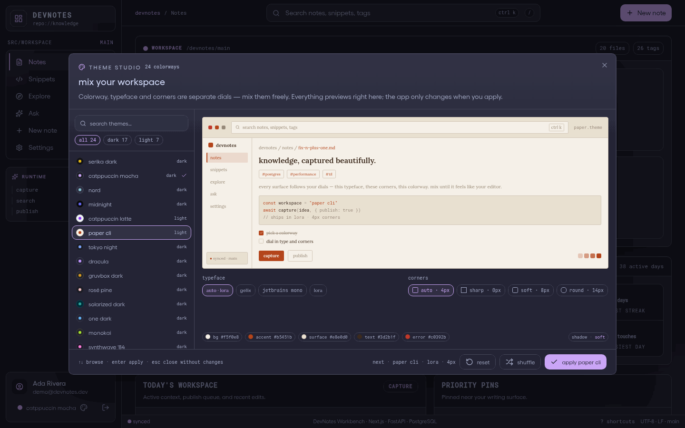

<sub>Theme Studio — opened over Catppuccin Mocha, previewing Paper CLI</sub>

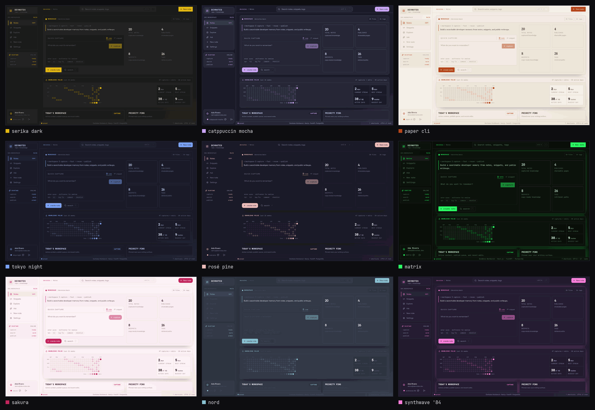

<sub>The same dashboard in Serika Dark (default), Catppuccin Mocha, Paper CLI, Tokyo Night, Rosé Pine, Matrix, Sakura, Nord and Synthwave '84</sub>

### Capture and retrieve

| Command palette (`Ctrl+K`) — Tokyo Night | Ask Workspace — Nord |
|---|---|
| 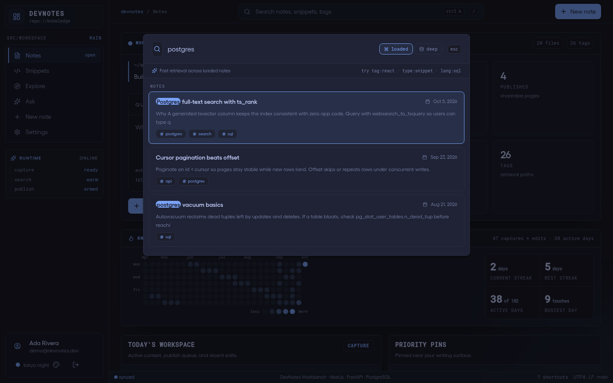 | 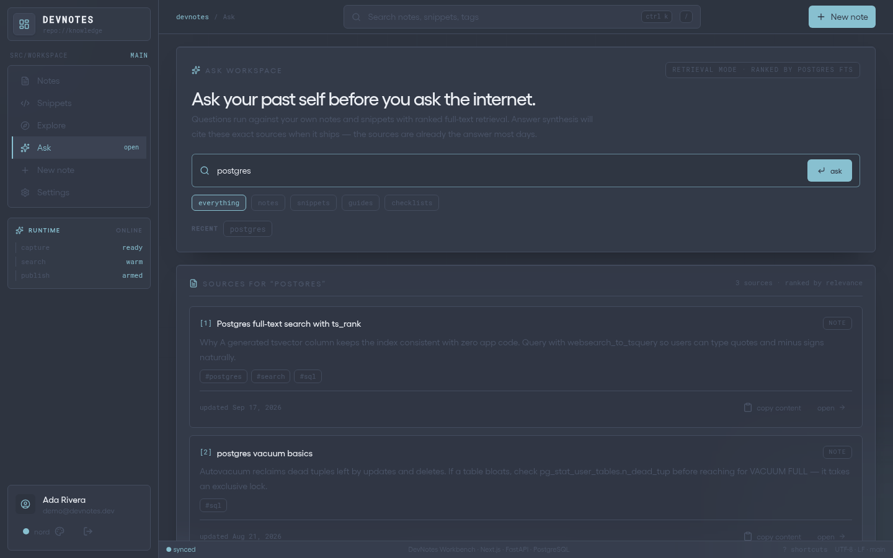 |

### Write and organize

| Editor — Paper CLI | Snippet vault — Rosé Pine |
|---|---|
| 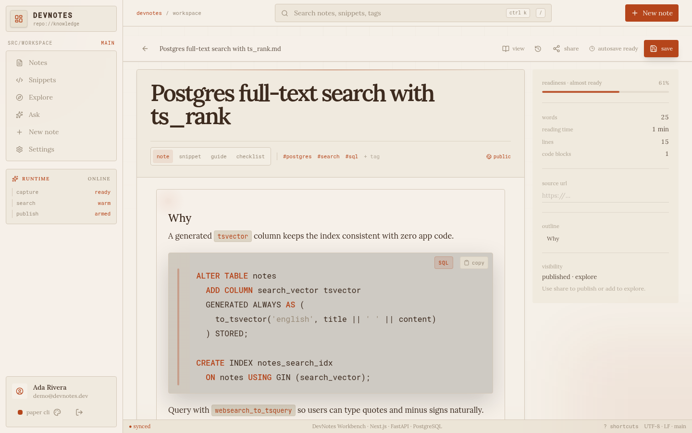 | 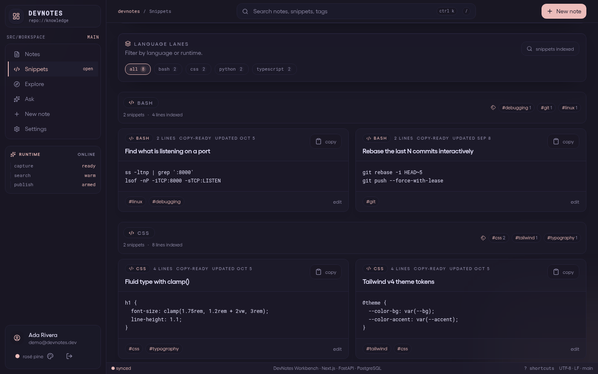 |

### Publish and share

| Public note — Sakura | Public profile — Matrix |
|---|---|
| 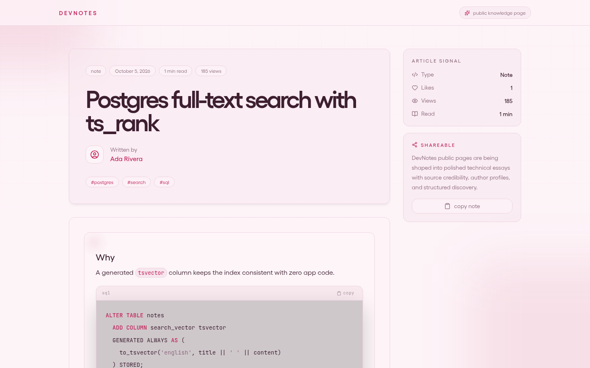 | 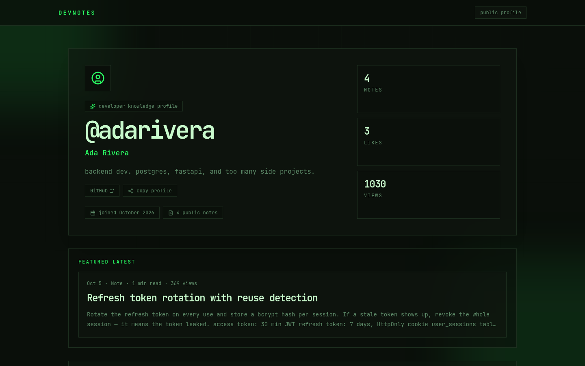 |

<details>
<summary><b>More: explore feed, first-run picker, mobile</b></summary>

<br>

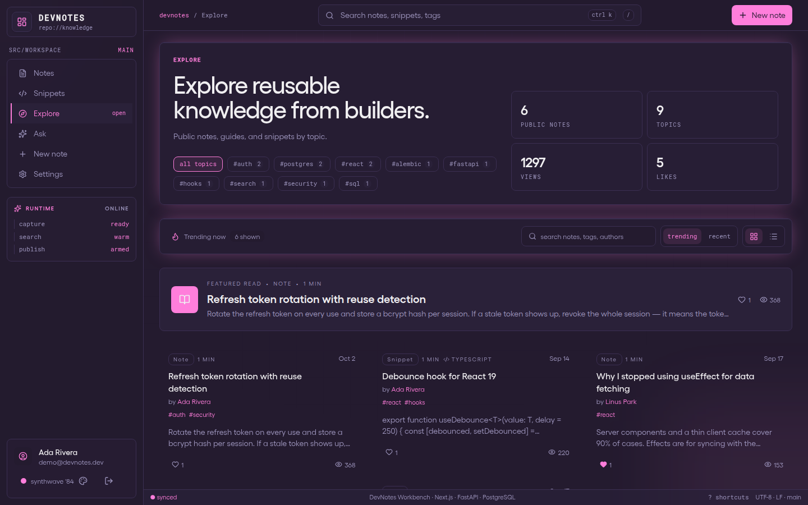

<sub>Explore feed — Synthwave '84</sub>

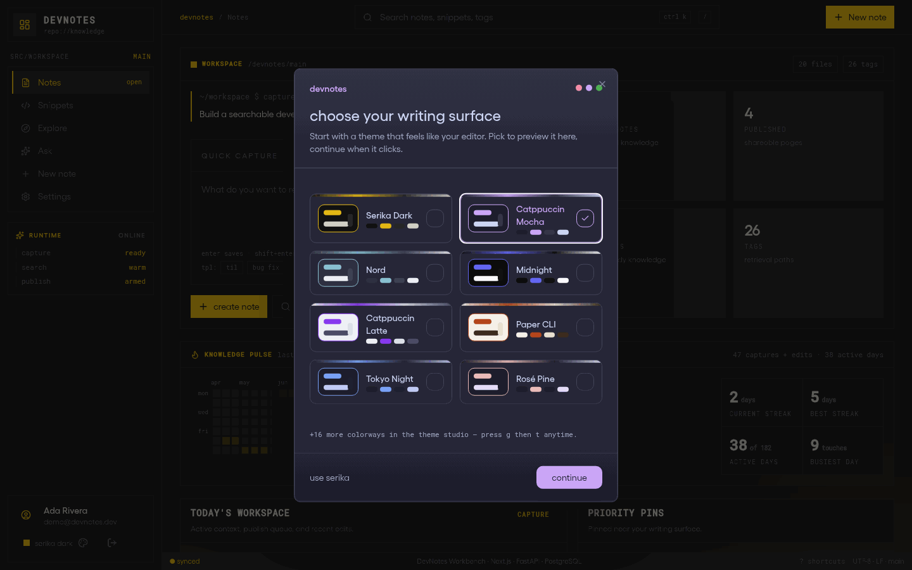

<sub>First-run picker — selecting a card re-themes the picker itself before you commit</sub>

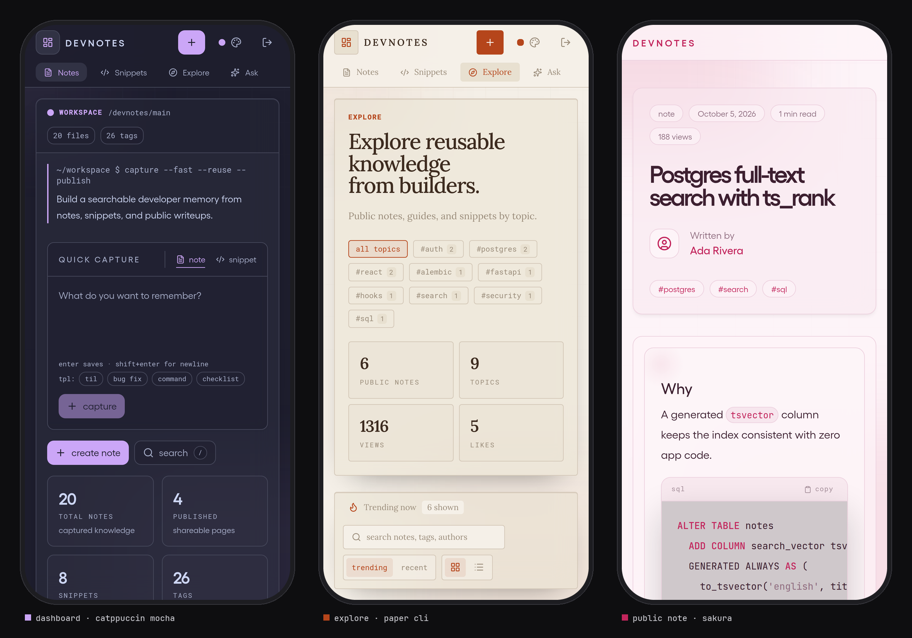

<sub>Mobile — Dashboard in Catppuccin Mocha · Explore in Paper CLI · Public note in Sakura</sub>

</details>

## Keyboard shortcuts

DevNotes is keyboard-first. Press `?` anywhere for the full overlay.

| Keys | Action | | Keys | Action |
|---|---|---|---|---|
| `Ctrl` `K` | Command palette | | `g` `d` | Notes dashboard |
| `/` | Search | | `g` `s` | Snippet vault |
| `n` | New note | | `g` `e` | Explore |
| `Enter` | Save (note mode) | | `g` `a` | Ask Workspace |
| `Shift` `Enter` | Newline | | `g` `p` | Settings / profile |
| `Ctrl` `Enter` | Save (always) | | `g` `t` | Theme Studio |
| `e` | Edit the open note | | `Esc` | Close |

## Tech stack

| Layer | Technology |
|---|---|
| Frontend | Next.js 16 (App Router), React 19 with the React Compiler, TypeScript, Tailwind CSS v4, shadcn/Radix, TipTap, Zustand |
| Backend | FastAPI, SQLAlchemy 2, Pydantic v2, Alembic, slowapi, python-jose, passlib/bcrypt |
| Database | PostgreSQL 16 — full-text search, generated columns, array columns |
| Tooling | Biome (lint/format), pytest, Docker Compose for local Postgres, GitHub Actions CI |

## Architecture

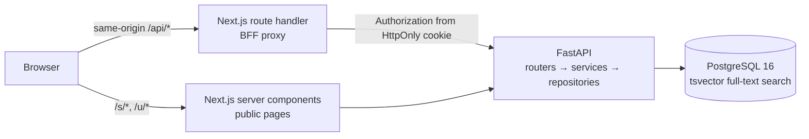

- The browser only talks to same-origin `/api/*`. The catch-all route handler (`admin/src/app/api/[...path]/route.ts`) is the single cookie writer: it re-attaches `Authorization` from the auth cookie and forwards to FastAPI via the server-side `BACKEND_URL`.
- Public pages (`/s/*`, `/u/*`) are server-rendered and fetch FastAPI directly, so they ship no editor bundle and are crawlable.
- The backend is layered: **routers** (HTTP) → **services** (business rules) → **repositories** (data access) → **models** (SQLAlchemy).

## Quick start

### Prerequisites

- Node.js 20+ (CI uses 22)
- Python 3.11+ (CI uses 3.12)
- Docker, for the local PostgreSQL container

### Setup

```bash
# 1. Clone
git clone https://github.com/rahuldr07/DevNotes.git
cd DevNotes

# 2. Backend environment — the defaults match the local Docker Postgres
cp backend/.env.example backend/.env          # PowerShell: Copy-Item backend/.env.example backend/.env

# 3. Install dependencies (a Python virtualenv is recommended)
npm --prefix admin install
python -m pip install -r backend/requirements.txt

# 4. Database
npm run dev:db        # start PostgreSQL 16 in Docker
npm run db:migrate    # apply Alembic migrations

# 5. Run — two terminals
npm run dev:backend   # FastAPI on http://localhost:8000 (OpenAPI docs at /docs)
npm run dev:frontend  # Next.js on http://localhost:3000
```

Open http://localhost:3000, create an account, and pick a writing surface. Backend health checks live at `/health` and `/health/db`.

> [!TIP]
> Using a managed PostgreSQL instead of Docker (RDS, Neon, Supabase, …)? Update the `DB_*` values in `backend/.env`. `backend/scripts/create_postgres_db.py` can bootstrap the role and database using the `POSTGRES_ADMIN_*` credentials.

## Configuration

### Backend — `backend/.env`

| Variable | Default | Description |
|---|---|---|
| `DB_HOST` / `DB_PORT` | — / `5432` | PostgreSQL host and port |
| `DB_NAME` / `DB_USER` / `DB_PASSWORD` | — | Database credentials |
| `DB_SSL_MODE` | `require` | libpq SSL mode (`.env.example` sets `disable` for local Docker) |
| `DB_POOL_SIZE` / `DB_MAX_OVERFLOW` | `10` / `20` | SQLAlchemy connection pool size |
| `DB_POOL_TIMEOUT` / `DB_POOL_RECYCLE` | `30` / `1800` | Pool wait and connection recycle, in seconds |
| `SECRET_KEY` | — | JWT signing key. **Set a long random value outside local development.** |
| `ALGORITHM` | `HS256` | JWT signing algorithm |
| `ACCESS_TOKEN_EXPIRE_MINUTES` | `30` | Access token lifetime |
| `POSTGRES_ADMIN_DB` / `_USER` / `_PASSWORD` | — | Only used by `scripts/create_postgres_db.py` |

### Frontend — server environment

| Variable | Default | Description |
|---|---|---|
| `BACKEND_URL` | `http://localhost:8000` | FastAPI base URL used by the BFF proxy and server components. Server-only — never exposed to the browser. |

## Scripts

Run from the repository root:

| Command | What it does |
|---|---|
| `npm run dev:db` | Start PostgreSQL 16 via Docker Compose |
| `npm run db:migrate` | Apply Alembic migrations |
| `npm run dev:backend` | FastAPI with auto-reload on `:8000` |
| `npm run dev:frontend` | Next.js dev server on `:3000` |
| `npm run lint` | Biome checks for the frontend |
| `npm run typecheck` | TypeScript checks for the frontend |
| `npm run build` | Frontend production build |
| `npm run test:backend` | Backend pytest suite |
| `npm run test` | Lint + typecheck + backend tests |

## Testing and CI

```bash
npm run test          # lint, typecheck and the backend suite
npm run build         # make sure the production build passes
```

The backend suite (51 tests across auth, refresh-token rotation, rate limits, validation, search ranking, pagination, privacy, versions, likes and profiles) overrides `get_db` and `get_current_user`, so it runs without a database.

[GitHub Actions](.github/workflows/ci.yml) runs the backend tests and the frontend lint, typecheck and build on every push to `master` and on every pull request.

## API overview

Interactive OpenAPI docs are served at `http://localhost:8000/docs`. In the browser, all calls go through the same-origin `/api/*` proxy.

| Method | Path | Auth | Purpose |
|---|---|---|---|
| `POST` | `/auth/register` | — | Create an account |
| `POST` | `/auth/login` | — | Sign in; issues access and refresh tokens |
| `POST` | `/auth/refresh` | refresh cookie | Rotate the refresh token, issue a new access token |
| `POST` | `/auth/logout` | — | Revoke the current session |
| `GET` | `/auth/me` | ✓ | Current user |
| `PATCH` | `/auth/profile` | ✓ | Update username, bio and links |
| `GET` | `/notes/notes` | ✓ | List your notes (cursor-paginated) |
| `POST` | `/notes/create` | ✓ | Create a note |
| `GET` | `/notes/{id}` | ✓ | Read one of your notes |
| `PATCH` | `/notes/{id}/update` | ✓ | Update a note (snapshots the previous version) |
| `DELETE` | `/notes/{id}/delete` | ✓ | Delete a note |
| `PATCH` | `/notes/{id}/pin` | ✓ | Pin or unpin |
| `GET` | `/notes/{id}/versions` | ✓ | Version history |
| `GET` | `/notes/{id}/versions/{version_id}` | ✓ | One full snapshot |
| `GET` | `/notes/search` | ✓ | Ranked full-text search with type/tag/language filters |
| `GET` | `/notes/community` | ✓ | Explore feed (trending/recent) |
| `POST` | `/notes/{id}/like` | ✓ | Toggle a like on a published note |
| `GET` | `/notes/public/{share_uuid}` | — | A published note |
| `GET` | `/notes/public/{share_uuid}/related` | — | Related published notes |
| `GET` | `/u/{username}` | — | Public developer profile |
| `GET` | `/health`, `/health/db` | — | Liveness and database checks |

## Project structure

```text
.
├── admin/                    # Next.js frontend (App Router)
│   ├── public/fonts/         # self-hosted UI fonts
│   └── src/
│       ├── app/              # routes: landing, auth, dashboard, ask, explore, /s, /u, /api proxy
│       ├── components/       # editor, palette, quick capture, theme studio, ui kit
│       └── lib/              # API wrappers, theme registry, formatting/clipboard helpers
├── backend/                  # FastAPI backend
│   ├── app/
│   │   ├── routers/          # auth, notes, profiles
│   │   ├── services/         # business logic
│   │   ├── repositories/     # data access
│   │   ├── models/           # SQLAlchemy ORM tables
│   │   └── schemas/          # Pydantic request/response models
│   ├── alembic/              # database migrations
│   ├── scripts/              # database bootstrap helper
│   └── tests/                # pytest suite
├── docs/                     # roadmap, product blueprint, worklog, screenshots, media
├── .github/workflows/ci.yml  # CI
├── compose.yaml              # local PostgreSQL 16
└── package.json              # root script hub
```

## Design decisions

**BFF proxy instead of direct API calls.** The browser only ever talks to same-origin `/api/*`. A catch-all Next.js route handler strips hop-by-hop headers, re-attaches `Authorization` from the auth cookie and forwards to FastAPI through a server-side `BACKEND_URL`. No CORS surface in production and no backend URL in client bundles.

**Session-backed refresh token rotation with reuse detection.** Access tokens are short-lived (30 min) stateless JWTs. Refresh tokens (7 days) live in an HttpOnly cookie, are rotated on every refresh, and are backed by a `user_sessions` table storing a bcrypt hash per device. Presenting a stale refresh token (hash mismatch) revokes the session — the classic token-theft defense.

**Full-text search in the database, not a search service.** `notes.search_vector` is a stored generated `TSVECTOR` column, so indexing is free and always consistent. Queries use `websearch_to_tsquery` + `ts_rank`. A lexical fallback ranker (title and tags weighted over body, phrase boosts) keeps search working on non-Postgres dev databases and is a stepping stone toward hybrid semantic ranking.

**Cursor pagination everywhere.** List endpoints paginate on `id < cursor` rather than offset, so pages stay stable while new notes are created.

**Version snapshots on write.** Updating a note snapshots the previous state into `note_versions` in the same transaction, trimmed to the latest 20 — history without unbounded growth.

**Rate limiting at the edge of the API.** slowapi with per-route budgets (register 5/min, login 10/min, create and search 30/min) on top of a 60/min default.

**Themes as data.** All 24 colorways live in one registry (`admin/src/lib/themes.ts`) and are applied through CSS variables and `data-theme` / `data-font` / `data-radius` attributes. A blocking init script applies the saved theme before first paint, so there is no flash of the wrong theme.

## Deployment

- **Frontend** — deploys as a standard Next.js app (the live instance runs on Vercel). Set `BACKEND_URL` in the server environment.
- **Backend** — any host that runs an ASGI app. Provide the variables from [Configuration](#configuration) with `DB_SSL_MODE=require` and a strong `SECRET_KEY`, run `python -m alembic upgrade head`, then start `uvicorn app.main:app --host 0.0.0.0 --port 8000 --workers 2` from `backend/`.
- **Database** — PostgreSQL 16 or newer; the connection pool settings are tuned for managed Postgres such as Aurora.

## Known limitations

- The rate limiter keeps counts in memory per worker process; a shared store such as Redis is needed for exact limits across workers or instances.
- Password reset and email verification are not implemented yet.
- The API's CORS allow-list only contains `http://localhost:3000`. The BFF proxy makes CORS unnecessary in production, but direct cross-origin browser calls to the API are rejected.

## Roadmap

1. LLM answer synthesis on Ask Workspace — answers must cite their source notes.
2. Semantic search with pgvector embeddings and hybrid (lexical + vector) ranking.
3. An MCP server so coding agents can search and save workspace notes.
4. Reuse analytics (`knowledge_events`) to surface the most-reused knowledge.
5. Password reset and email verification.

Long-form planning lives in [`docs/DEVNOTES_1000X_ROADMAP.md`](docs/DEVNOTES_1000X_ROADMAP.md), [`docs/DEVNOTES_1000X_PRODUCT_UI_BLUEPRINT.md`](docs/DEVNOTES_1000X_PRODUCT_UI_BLUEPRINT.md) and the shipped-state log in [`docs/WORKLOG.md`](docs/WORKLOG.md).

## Contributing

Issues and pull requests are welcome.

1. Fork the repository and create a branch from `master`.
2. Make your change, keeping commits small and focused.
3. Run `npm run test` and `npm run build` — both must pass.
4. Use short, lowercase, hyphenated commit messages that describe the change, e.g. `fix-search-palette-render-loop`.
5. Open a pull request describing what changed and why; include screenshots for UI changes.

## License

This repository does not include a license yet, so default copyright applies and the code may not be reused without permission. Open an issue if you'd like to use it.
